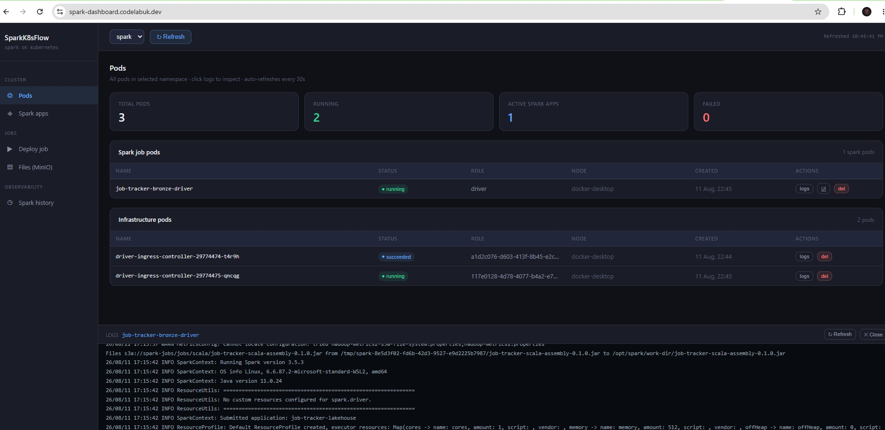

# Labuk Data Platform

A self-hosted data platform for experimenting with Spark, Kafka, and Iceberg on Kubernetes — Kafka (Strimzi, KRaft mode) for streaming, Spark Operator for running jobs, Hive Metastore + PostgreSQL as the Iceberg catalog, MinIO as S3-compatible storage, and a custom dashboard for deploying and watching jobs. Runs locally on Docker Desktop Kubernetes today, with a cloud overlay reserved for later (`k8s/overlays/`).

## Dashboard



## Architecture

```
Namespaces:
  ingress-nginx   → NGINX ingress controller (routes HTTP traffic to services)
  kafka           → Strimzi operator + Kafka cluster (KRaft mode, no Zookeeper)
  metastore       → Hive Metastore + PostgreSQL (Iceberg catalog backend)
  minio           → MinIO object storage (S3-compatible, replaces AWS S3)
  spark-operator  → Spark Operator (manages SparkApplication CRDs)
  spark-platform  → Spark Dashboard (custom Flask app)
  spark           → Spark jobs, History Server, driver-ingress CronJob
```

Every Ingress hostname is derived from a single `DOMAIN` value (default `codelabuk.dev`, overridable) — see [docs/local-setup.md](docs/local-setup.md#configuring-the-domain).

## Repo layout

| Path | Contents |
|------|----------|
| `k8s/base/` | Kustomize base manifests, one directory per component |
| `k8s/overlays/` | `local` (Docker Desktop) and `cloud` (reserved) overlays |
| `scripts/` | `bootstrap-local.sh`, `teardown-local.sh`, and setup utilities |
| `jobs/` | Spark job source — Scala (`jobs/scala/`), Python (`jobs/python/`), the job Docker image (`jobs/docker/`), and legacy test manifests (`jobs/spark/`) |
| `dashboard/` | Custom Flask app for deploying/monitoring Spark jobs |
| `helm/values/` | Point-in-time dumps of the Helm values currently deployed (ingress-nginx, Strimzi, spark-operator) |
| `docker/` | Standalone docker-compose labs (e.g. ClickHouse), unrelated to the k8s platform |
| `docs/` | Setup guides and reference snapshots |

## Quick start

```bash
DOMAIN=yourdomain.test ./scripts/bootstrap-local.sh   # or just ./scripts/bootstrap-local.sh for the codelabuk.dev default
./scripts/teardown-local.sh                            # tear it all back down
```

Full prerequisites, step-by-step install order, and troubleshooting: **[docs/local-setup.md](docs/local-setup.md)**.
